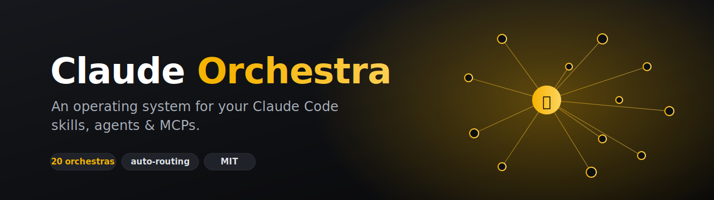
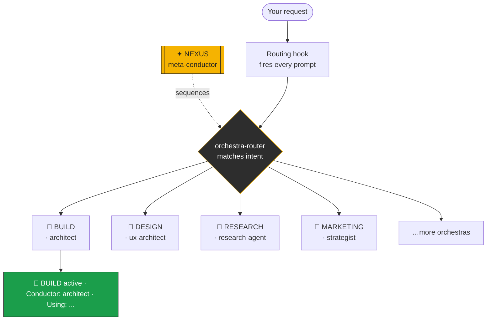

<div align="center">



# 🎼 Claude Orchestra

**An operating system for your Claude Code skills, agents & MCPs.**


</div>

---

You installed 50, 200, maybe 500+ skills, agents, and MCP servers. Now you have no idea what's
active, what fires when, or whether half of them are wasted. **Claude Orchestra fixes that** — it
organizes your entire toolkit into themed *orchestras*, each with a conductor, clear triggers, and
automatic routing, so the right tools fire for the right task. Every time.

## The problem

```
Your ~/.claude right now:
  hundreds of skills · dozens of agents · plugins · MCPs · connectors
  → "Which one handles this task?"            🤷
  → "Did I install something for this already?" 🤷
  → "Why did THAT skill just fire?"            🤷
```

More tools should mean more power. Instead it means more chaos. There's no *system*.

## The fix: orchestras

Claude Orchestra files every tool into themed **orchestras**. Each has **one conductor** that
sequences its players, clear **triggers**, and quality **gates**. A routing hook reads every
request and activates the right orchestra automatically — and announces it, so you always know
what's playing.



## Quick start

**The easy way** — paste this into Claude Code:

```
Install this for me: https://github.com/Momo2323-ui/claude-orchestra
```

Claude reads the repo, runs the installer, and sets everything up.

**The manual way:**

```bash
git clone https://github.com/Momo2323-ui/claude-orchestra
cd claude-orchestra
./install.sh        # requires jq; backs up settings.json; idempotent
```

Then open a new Claude Code session and edit `~/.claude/rules/orchestra-system.md` to fill the
rosters with *your* tools (takes ~10 min — see [docs/CREATE-YOUR-ORCHESTRA.md](docs/CREATE-YOUR-ORCHESTRA.md)).

## Install (for Claude Code agents)

If you're a Claude Code agent installing this from the repo URL, do exactly this:

1. Run `./install.sh` from the repo root (it requires `jq`). It will:
   - copy `skills/orchestra-router` and `skills/orchestra-intake` → `~/.claude/skills/`
   - copy `hooks/orchestra-route.sh` → `~/.claude/hooks/` and `chmod +x` it
   - copy `orchestra-system.md` → `~/.claude/rules/` (only if not already there)
   - register the hook under `hooks.UserPromptSubmit` in `~/.claude/settings.json` **via a `jq`
     merge that backs up the file first and never clobbers existing hooks**
   - append the orchestra rule to `~/.claude/CLAUDE.md` (only if not already present)
2. If `jq` is missing, install it (`brew install jq`) then re-run.
3. Tell the user to edit `~/.claude/rules/orchestra-system.md` and fill in their tools.

The installer is idempotent — running it twice changes nothing the second time.

## How it works

1. **The constitution** (`orchestra-system.md`) defines your orchestras — rosters, conductors, triggers, gates.
2. **The routing hook** injects a routing directive on every prompt.
3. **The router skill** matches your request to the right orchestra(s) and announces them.
4. **The intake skill** files anything new you install into the right orchestra — never archived.

→ Full walkthrough in [`docs/HOW-IT-WORKS.md`](docs/HOW-IT-WORKS.md)

## Build your own orchestras

The framework ships as a template. [`docs/CREATE-YOUR-ORCHESTRA.md`](docs/CREATE-YOUR-ORCHESTRA.md)
walks you through mapping *your* tools into orchestras in about ten minutes.

## See a real setup

Want a worked example? [`examples/my-20-orchestras.md`](examples/my-20-orchestras.md) is a real
20-orchestra config — rosters, the reasoning behind each placement, and links to every skill so
you can install the ones you like.

## FAQ

**Does this install any skills/agents for me?** No. Claude Orchestra is the *organization layer* —
it doesn't bundle anyone else's tools. The example config links to skills at their original repos
so you install them yourself (and the authors get the credit).

**Will it overwrite my settings?** No. The installer backs up `settings.json`, merges with `jq`
without clobbering existing hooks, and only appends to `CLAUDE.md` if the rule isn't already there.

**Do I have to use all 20 orchestras?** No. Delete, merge, or rename freely. The themes are a
starting taxonomy, not a rulebook.

**Do I need NEXUS?** No — it's optional. Delete the section if you don't want a meta-conductor.

## Contributing

PRs and new-orchestra ideas welcome — see [CONTRIBUTING.md](CONTRIBUTING.md).

## Credits

Built by [Moksh Mittra](https://github.com/Momo2323-ui). MIT licensed — use it freely. Every skill
referenced in the example links to its original author.
